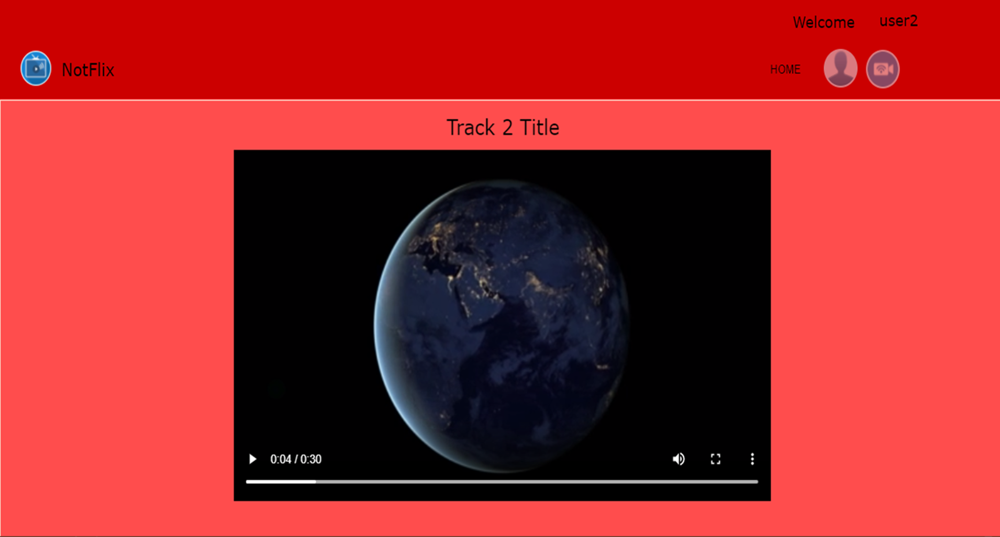

# Project title

### NotFlix

** Version 1.0 **

##  About / Synopsis

Project status: working/prototype.

NotFlix - cloud based video streaming service. NotFLIX is created to be an open source solution for streaming live video, right into the web browser using the HTML5 video tag.

The current version is a working prototype, which showcases the main ideas. The main design goal is low resource usage, build a proof-of-concept cloud application and NotFlix would gain insights into how their users are interacting with content e.g pause, play, stop etc. Additionally, the analytics team can extract data into their analytic platform using a secure connection. 

The proof-of-concept demonstrates the functionality of the tiers and inlcudes a minimum load balancing to handle web traffic, showcases high availability, and automated shaping of the service component.

##  Getting started

Instructios will guide to setup working environment for development and testing purposes. Deployment notes guides you to deploy the project on a live system.

>   * [Installation](#installation)

>   * [Deployment](#deployment)

>   * [License](#license)

##  Installation

1.  Initially you should have administrator privileges, to setup the environment

2.  Using docker-compose.yaml configure - WEBSERVER, PHP and MYSQL on your development environment,
  
    ```
    docker-compose up -d
    docker images
    docker ps
    ```

3.  Configure your server to deploy PHP files. Create your .php files, place them in your web directory. 

    The server will automatically parse them for you.

4.  Setup your database configurations and connect to the database for storing information.

##  Deployment

1.  Clone the github repository

    e.g github public repo link:

    ```
    git clone https://github.com/maryama2021/notflix.git 
    ```

    use relavent commands, to commit and push to the repo
    ```
    git status
    
    git add *

    git branch -M master
    
    git commit -m "initial commit"

    git remote add origin https://github.com/maryama2021/notflix.git
    
    git push -u origin master
    ```

3.  Using - Jenkins plugin manage credentials - establish docker hub credentials

4.  Deploy jenkins freestyle job - to compile, build, and package the application

5.  Jenkins build will push the image to docker hub 

    docker hub repository link: [DockerHub](https://hub.docker.com)

    ```
    curl http://<ipaddress>
    ```
6.  Jenkins URL http://3.239.115.222:8080/

7.  SonarQube URL http://3.239.115.222:9000/

8.  Hit the page in the browser - http://yourhostaddress - Login and view the video gallery and click the video, the video is ready for streaming.

    Page looks like this,

    

##  License

    NotFlix Ltd - UK based video streaming service with a global client base.

---
